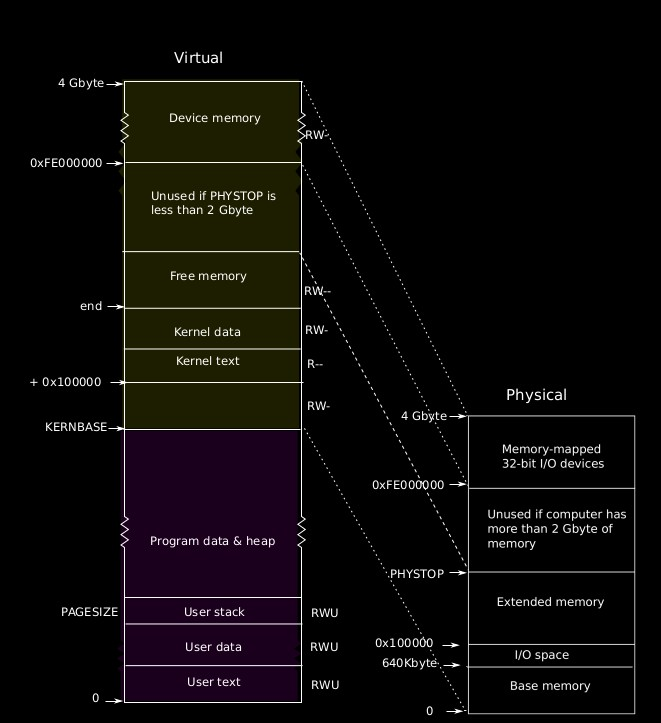

# 2 - Page Tables

## Paging hardware

Note that x86 instructions (both user and kernel) manipulate virtual addresses. 

For x86, page size is 4KB (12-bit). So the number of Page Table Entries is 2 ^ (32-12) = 2 ^ 20. Each PTE contains a 20-bit physical page number (PPN) and some flags. The paging hardware uses the top 20 bits of a virtual address to index into the page table, and replacing the top 20 bits with the PPN. 

In xv6, page directory is used. The 4096-byte page diretory contains 1024 pointers to sub-tables, each containing 1024 PTEs.

Each PTE contains flag bits. `PTE_P` is the present bit, `PTE_W` indicates whether the page can be written, `PTE_U` indicates whether user can use the page. These are defined in `mmu.h`.

At this stage, we only have *virtual address*, but no *virtual memory* yet.

## Process address space

`Entrypgdir` defined by `main.c` is used by `entry.S` and enables kernel to run. However, it's soon replaced by a new page table by calling `kvmalloc`. 

Each process has a page table. A process's user memory is `[0x0, KERNBASE]` (at most 2GB). So in xv6, **each user process's address space is 2GB**, no matter how large/small the physical memory is. Practically, xv6 only uses 256MB physical memory.

When a process asks for more memory, xv6 first finds free physical pages, then adds PTEs to the page table, with flags set.  Read the following explanation alongside the picture below:

Kernel instruction and data are mapped above `KERNBASE+EXTMEM` in every process's memory space (`EXTMEM` = `0x100000`). It maps virtual addresses `[KERNBASE, KERNBASE+PHYSTOP]` to physical addresses `[0, PHYSTOP]` (`PHYSTOP` is the top of physical memory, `PHYSTOP` = `0xE000000` = `224MB`). `KERNBASE` is `0x80000000`. Essentially, the upper half of the memory space is mapped to the physical memory. The advantage of this mapping is that the kernel can manipulate the physical memory easily, while the disadvantage is that xv6 cannot utilize more than 2GB of physical memory. Thus, xv6 requires `PHYSTOP` to be at most 2GB. Also, memory-mapped I/O devices appear from `0xFE000000`, so `PHYSTOP` must be at most 2GB - 32MB. So theoretically, xv6 can use 2GB of physical memory, with 32MB dedicated for memory-mapped I/O devices.

Note that xv6 uses only 256MB of physical memory. `[0, PHYSTOP] = 224MB` (`PHYSTOP` is `0xE000000`) and `[0xFE000000, 0xFFFFFFFF] = 32MB` add up to be 256MB. Also note that {kernel text, kernel data, free memory} in virtual memory space maps to {Extended Memory} in physical memory. 

Having each process's page table contain mappings for both user memory and the entire kernel is conveninent for switching from user code to kernel code during syscalls and interrupts: such switches don't require page table switches. Normally the kernel doesn't have its own page table, but borrows the process's page table. 

## Code: creating an address space

`main` calls `kvmalloc`, which calls `setupkvm` to do the work. This is to create a page table with the mappings **above `KERNBASE`** required for the kernel to run. 

`kmap` defines four blocks.

| Virtual memory range          | Physical memory range  |
| ----------------------------- | ---------------------- |
| [KERNBASE, KERNBASE + EXTMEM] | [0, EXTMEM]            |
| [KERNBASE + EXTMEM, data]     | [EXTMEM, V2P(data)]    |
| [data, DEVSPACE]              | [V2P(data), PHYSTOP]   |
| [DEVSPACE, 0xFFFFFFFF]        | [DEVSPACE, 0xFFFFFFFF] |

Note the direct map for the 4-th block, memory-mapped devices. The physical memory range for those devices are fixed. 

## Physical memory allocation

Xv6 uses physical memory between the end of the kernel and `PHYSTOP` for run-time allocation of pages. It maintains a free list of pages. 

A problem is that: the entire physical memory should be mapped to create the free list, but creating the page table requires allocating page-table pages. Xv6 solves this by using a separate page allocator during entry, which allocates memory just after the end of the kernel's data segment. 

## Code: Physical memory allocator

`kinit1` and `kinit2`. 

## User part of an address space

The stack is a single page in xv6, with an guard page below it. The guard page is not mapped, so hardware exception would be generated if the stack grows beyond the one page limit. 

## Code: sbrk

Read the book.

## Code: exec

Read the book.